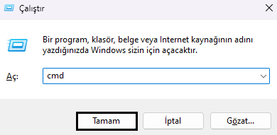
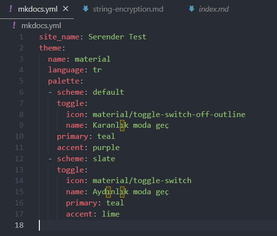

# MkDocs Nedir? / Nasıl Kurulur?
## **MkDocs Nedir?**
MkDocs Markdown(md) formatında dokümanlar hazırlamamızı sağlayan bir doküman sistemidir. MkDocs yazılan dokümanları statik bir web sitesi olarak export eder. Bunlarla beraber çeşitli tema ve eklentilere sahiptir.

MkDocs Python ile geliştirilmiş bir araçtır ve kullanımı için python kurulumuna ihtiyaç duyulmaktadır.

## **MkDocs Kurulumu**
MKDocs kurulumu için öncelikle bilgisayar python kurulmalıdır. Python’u bilgisayara kurmak için [Python İndir](https://www.python.org/downloads/) bağlantısından Python’u bilgisayara kurabilirsiniz.

Python’u bilgisayara indirdikten sonra kurulumu açtığımızda gelen pencerede altta bulunan ***Use admin privileges when installing py.exe*** ve ***Add python.exe to PATH*** seçeneklerini işaretleyip ***Install Now*** seçeneğini seçiyoruz.


Kurulum bittikten sonra karşımıza gelen pencerede altta bulunan ***Disable path length limit*** seçeneğini seçerek kurulumu sonlandırıyoruz.


Ardından klavyede ***Space (Boşluk)*** tuşunun solunda bulunan ***Windows*** tuşu ve ***R*** tuşuna basarak ***çalıştır*** penceresini açıyoruz ve açılan pencereye ***cmd*** yazıp tamam butonuna tıklıyoruz ve komut istemcisi penceresine ulaşıyoruz.




Karşımıza gelen komut istemcisi penceresine 
```python
python -m pip install --upgrade pip
```
yazıp **enter** tuşuna basarak python ile beraber kurulan pip paket yönetim sistemini son sürüme güncelliyoruz.


Pip güncellendikten sonra mkdocs’u indirebiliriz. MkDocs’u indirmek için yine komut istemcisi penceresine 
```python
pip install mkdocs
```
yazarak enter tuşuna basıyoruz ve mkdocs’u bilgisayarımıza indiriyoruz.


MkDocs bilgisayarımıza kurulduktan sonra dokümanı oluşturmak istediğimiz yerde bir klasör oluşturarak klasörün içerisine giriyoruz. Klasörün içerisine girdikten sonra ***klasörün arama çubuğuna*** bir kez tıklıyoruz ve ***cmd*** yazıp ***enter*** tuşuna basıyoruz.


Bu işlemi gerçekleştirdikten sonra klasör yolunu içeren bir komut istemcisi penceresi açmış olacağız ve MkDocs dosyalarımızı bu klasör içerisine oluşturacağız.

Açılan komut istemcisi penceresine 
```python
python -m mkdocs new {projeAdi}
``` 
yazıp ***enter*** tuşuna basarak mkdocs projemizi oluşturabiliriz.


Oluşturulan dosya ve dosya içeriği aşağıdaki gibi olacaktır.


Oluşturduğumuz projeyi Visual Studio Code editörünü kullanarak düzenleyebiliriz. Docs isimli klasörümüzün içerisinde proje içerisinde bulunacak dokümanların md formatında yazılmış hali bulunmalıdır. YML dosyası ise kullanılan tema, eklenti, dil ayarı, karanlık & aydınlık mod gibi doküman sistemi içerisinde yapılacak ayarların yapıldığı dosyadır.


Bir tema indirmek için (örneğin material teması) Visual Studio Code içerisinde projeyi açtıktan sonra terminal penceresine 
```python
pip install mkdocs-material
```
yazıp enter tuşuna basarak temayı indirebiliriz.


Yüklenebilecek bazı temalar:
```python
pip install mkdocs-bootstrap
```
```python
pip install mkdocs-windmill
```
```python
pip install mkdocs-cinder
```
```python
pip install mkdocs-readthedocs
```

Hazırlanan örnek yml dosyası ise aşağıdaki gibidir. Bu YML dosyasında material teması kullanılmış ve dil ayarı türkçe olarak ayarlanmıştır. Ayrıca karanlık ve aydınlık mod için toggle butonu eklenmiştir. 



